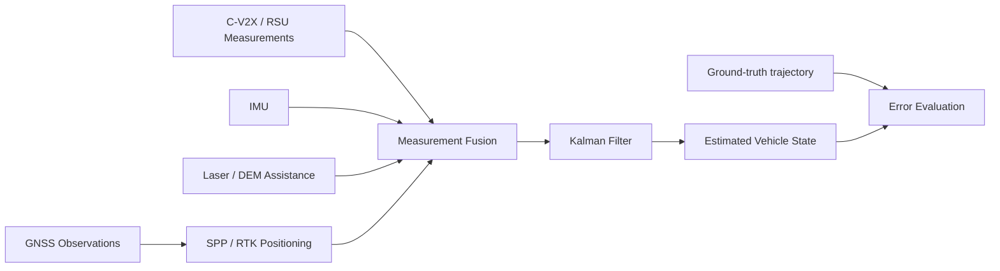
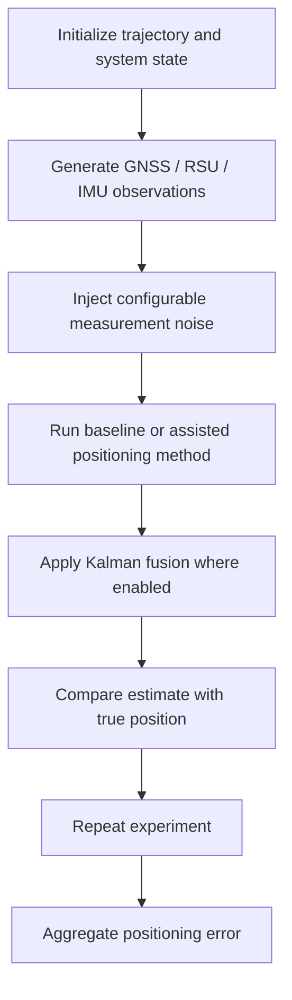

<div align="center">

# C-V2X Positioning Simulation
### Synchronous Positioning under Weak-GNSS Scenarios


</div>

## Overview

This repository contains a MATLAB-based simulation project for studying **C-V2X-assisted positioning under weak GNSS conditions**. The project explores how roadside infrastructure, inertial sensing, filtering, and alternative positioning strategies can improve localization robustness when satellite measurements become noisy or partially unavailable.

The code is organized as a collection of compact simulation modules so that individual positioning components can be compared independently and then combined into a multi-source positioning pipeline.

## System View



## Research Goal

Weak-GNSS environments can produce large positioning errors or unstable solutions. This project studies whether C-V2X infrastructure and auxiliary sensing can compensate for such degradation. The simulation is intended to compare conventional GNSS positioning with assisted and fused alternatives under controlled noise settings.

## Main Components

| File | Role |
| --- | --- |
| `SPP.m` | Single-point positioning baseline |
| `CV2X_RTK.m` | C-V2X / RTK-oriented positioning experiment |
| `CV2X_Kalman.m` | C-V2X positioning with Kalman filtering |
| `Kalman.m` | Generic Kalman filtering utilities |
| `IMU.m` | Inertial measurement simulation |
| `RSU.m` | Roadside-unit related measurement modeling |
| `Laser_DEM.m` | Auxiliary ranging / terrain-related assistance |
| `NonIMUComp.m` | Comparison without IMU information |
| `NonIntegrationComp.m` | Comparison without full sensor integration |
| `NoiseSet.m` | Simulation noise configuration |
| `Gaussian.m` | Gaussian noise generation |
| `primaryBSSelection.m` | Primary base-station selection |
| `initialState.m` | Initial state configuration |
| `true_pos.m` | Ground-truth trajectory / position generation |
| `RepeatExp.m` | Repeated-experiment evaluation |

## Experimental Logic

A typical experiment follows the sequence below:



The separate comparison scripts make it possible to isolate the contribution of individual sources such as IMU assistance or integrated fusion.

## Suggested Entry Points

For reproducing the main experiments, start with:

```matlab
CV2X_RTK
CV2X_Kalman
RepeatExp
```

Before running, inspect `NoiseSet.m`, `initialState.m`, and the measurement-generation scripts to understand the assumptions used by the original simulation.

## Requirements

- MATLAB

The project is implemented with `.m` scripts and does not rely on a Python package environment. Depending on the MATLAB version, some toolbox-dependent functions may need adaptation.

## Repository Structure

```text
C-V2X/
├── CV2X_RTK.m                 # Assisted RTK-style positioning
├── CV2X_Kalman.m              # C-V2X + Kalman fusion
├── SPP.m                      # GNSS baseline
├── Kalman.m                   # Filter implementation
├── IMU.m                      # IMU simulation
├── RSU.m                      # Roadside-unit model
├── Laser_DEM.m                # Auxiliary positioning information
├── NonIMUComp.m               # Ablation / comparison
├── NonIntegrationComp.m       # Ablation / comparison
├── NoiseSet.m                 # Noise configuration
├── Gaussian.m                 # Noise generation
├── primaryBSSelection.m       # Base-station selection
├── initialState.m             # Initial conditions
├── true_pos.m                 # Ground truth
├── RepeatExp.m                # Repeated evaluation
└── README.md
```

## What This Project Demonstrates

- Simulation-oriented algorithm prototyping in MATLAB.
- Multi-source positioning and sensor-fusion thinking.
- Kalman-filter-based state estimation.
- Controlled comparison between baseline and assisted positioning methods.
- Evaluation under configurable measurement-noise conditions.

## Notes

This is an earlier research/project implementation preserved for reproducibility and portfolio purposes. The scripts reflect the assumptions and parameter settings used during the original project and may require small changes for a different MATLAB version or experimental scenario.

## Author

**Bo Liu**  
College of Computer Science and Electronic Engineering, Hunan University  
Contact: `liubo317@hnu.edu.cn`  
Homepage: https://boliupro.github.io
